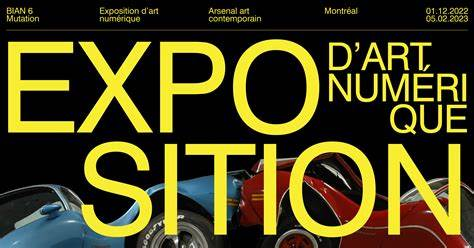
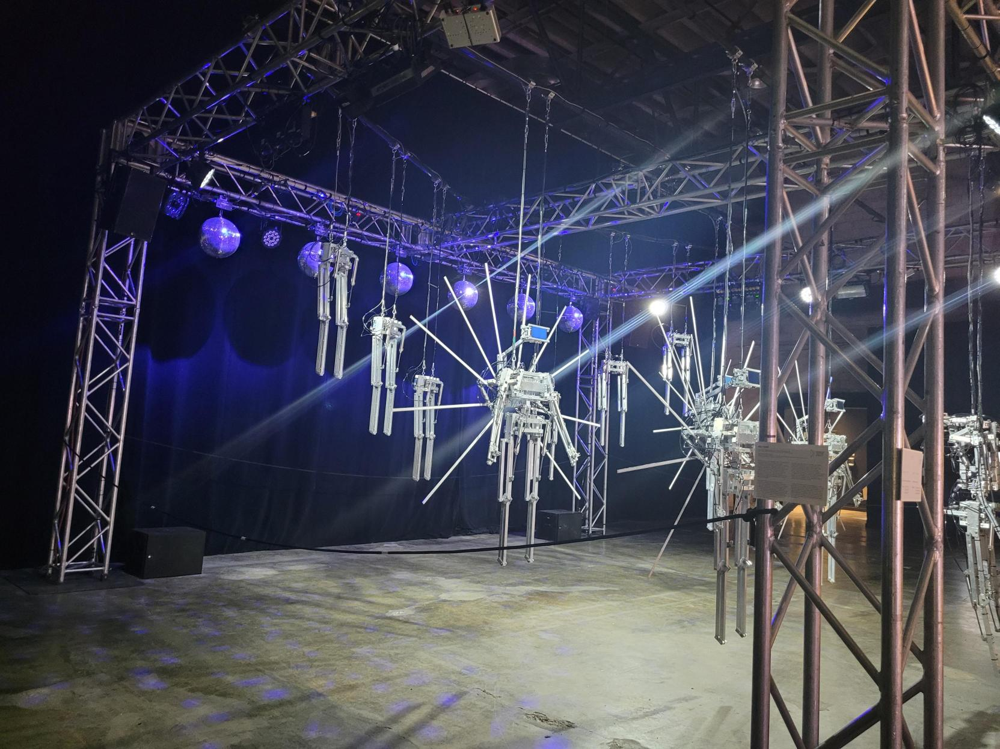
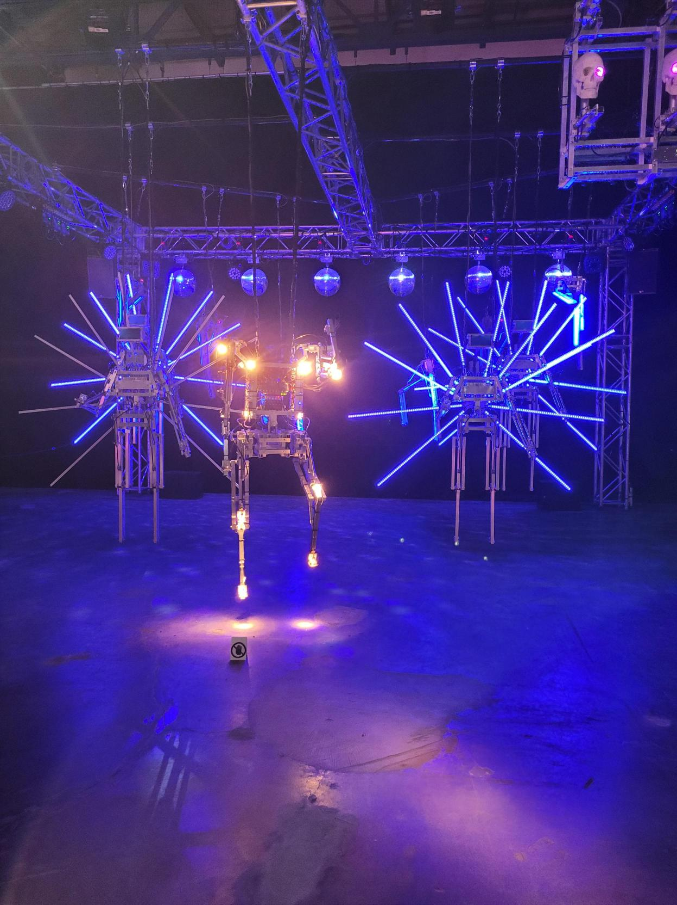
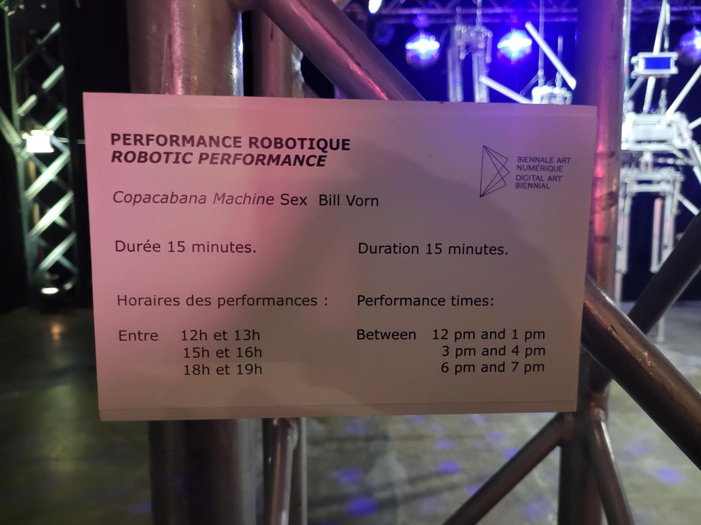

## BIAN

### Nom de l'exposition ou de l'événement
6e Biennale d'art numérique

 

### Lieu de mise en exposition
Arsenal art contemporain

 

### Type d'exposition
L'exposition est intérieur et temporaire

### Date de votre visite
2 février 2023

### Titre de l'oeuvre 
performance robotique copacabana machine sex

### Nom de l'artiste
Bill Vorn

### Année de réalisation 
2018

### Description de l'oeuvre 
Elle est une performance robotique musicale. Sa duration est de 30 minutes et peut être jouée un total de 4 fois par jour. Les acteurs sont les propres robots

 
 
 

### Type d'installation
L'installation est seulement contemplative

### Mise en espace

 

### Composantes et techniques
Premièrement, les matériels utilisés par l'artiste ont été des métaux, miroirs, moteurs, éclairage LED, ordinateur, compresseur à air, audio stéréo. Deuxièmement, ses projets d'installation et de performance impliquent le contrôle du mouvement, le son, l'éclairage, la vidéo et les processus cybermétiques.

### Éléments nécessaires à la mise en exposition
Des barres en métal pour pouvoir tenir l'exposition, les moniteurs de son pour pouvoir le projecter, des fils pour ne pas permettre le passages des spectateurs.

### Expérience vécue
https://youtube.com/shorts/XghE0QNKZtc

### Ce qui m'a plu
Ce que j'ai aimé de cette oeuvre c'est tout le matériel qui a été utilisé pour créer quelque chose de simple comme danser. Le fait d'utiliser des robots pour faire une activité très humaine comme danser nous démondre l'avancement technologique qu'on fait et en même temps ça ouvre les portes pour un futur où les robots auront plus d'importances pour les spectacles.

### Aspect à ne pas retenir
Ce que j'ai moins aimé c'est que l'oeuvre est très repetitif et après quelques minutes tu as la sensation de voir les mêmes mouvements. Aussi, les mouvements sont pas très flexibles et ne démontrent pas les capacitées que les humains par exemple pourraient avoir. Finalement je trouve que l'oeuvre est très correct, mais elle est encore trop basique pour penser à mettre des robots sur des grandes spectacles.
