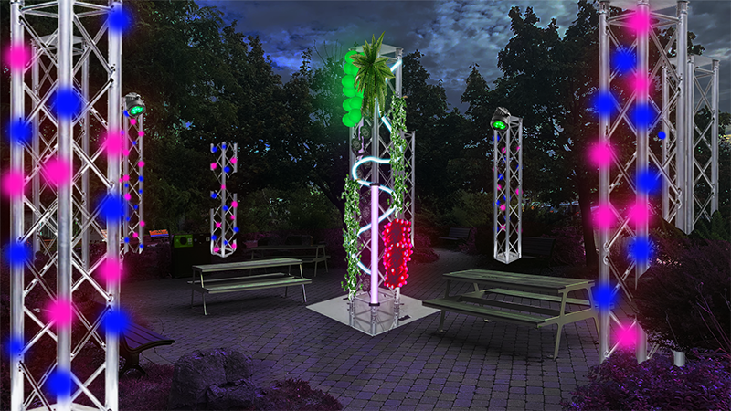
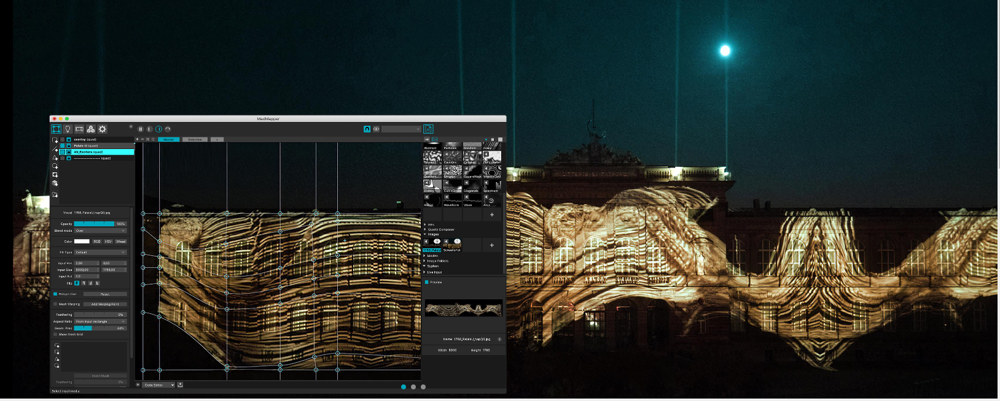

# Projets étudiants du plus aimé au moins aimé

## 1. Edria

## Nom étudiants
- Elwin Durand
- Loic Delorme
- Dominic Roberts
- Gabriel Leblanc
- Meryem Berbiche
- Jean-Christophe

[Production](https://github.com/F-C-A/EDRIA/tree/main/docs/preproduction#cartographie)

## 2. cours du programme sont nécessaires pour créer ce gerne de projet

- Conception d’une expérience multimédia
- Installation multimédia
- Modélisation 3D

## technique* ou une composante technologique

- MadMapper

MadMapper est une technologie multimédia permettant de projeter de la lumière ou des vidéos sur des volumes

