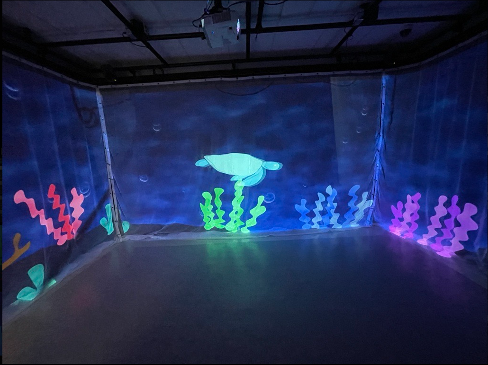
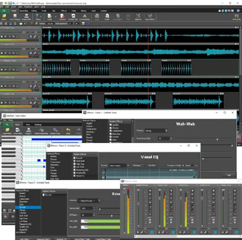

# Projets étudiants du plus aimé au moins aimé

## 1. Edria

## Nom étudiants
- Elwin Durand
- Loic Delorme
- Dominic Roberts
- Gabriel Leblanc
- Meryem Berbiche
- Jean-Christophe

[Production](https://github.com/F-C-A/EDRIA/tree/main/docs/preproduction#cartographie)

## 1.1 cours du programme sont nécessaires pour créer ce gerne de projet

- Conception d’une expérience multimédia
- Installation multimédia
- Modélisation 3D

## 1.2 technique* ou une composante technologique

- MadMapper

MadMapper est une technologie multimédia permettant de projeter de la lumière ou des vidéos sur des volumes

## 1.3 Préférence actuelle

- J'ai aimé beaucoup ce projet et je le met en première place, car je trouve que c'est le projet le plus compliqué. J'ai aimé aussi la manière dont le projet à été expliqué et je trouve qu'ils étaient plus avancés que les autres.

## 1.4 Ressentiment vers l'expérimentation de l'installation

- Je pense qu'avec la grandeur des structures et les sons qu'ils vont produire lors de l'interactivité vont être impresionant et ça va être vraiment attirant pour tout les gens qui vont passer proche de la structure.

## 2. Echomarine

## Nom étudiants
- Florence Lapierre
- Natacha Abdallah
- Tracy Gua
- Maria Laura Coronel

[Production](https://github.com/Echomarine/Echomarine/tree/main/docs/preproduction)

## 2.1 cours du programme sont nécessaires pour créer ce gerne de projet

- Animation 2D
- Audio 2
- Conception d’une expérience multimédia

## 2.2 technique* ou une composante technologique

- Reaper

Logiciel sonore pour créer des effets et enregistrer des sons

## 2.3 Préférence actuelle

- J'aime beaucoup le sujet du projet, car j'aime les animaux et la manière dans laquelle ils les montrent c'est vrsiment intéressant. En plus ils donnent les descriptions de chaque animaux.

## 2.4 Ressentiment vers l'expérimentation de l'installation

- Je pense que même si le projet est seulement contemplative, ça va être tr5ès intéressant d'aller le régarder et s'inmerser avec les effets sonores.

## 3. Lumasol

