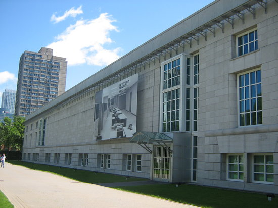
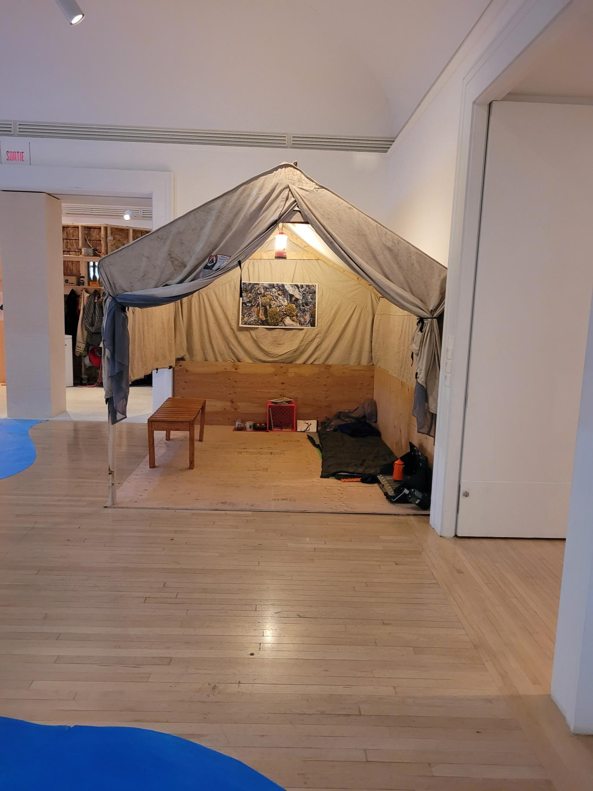
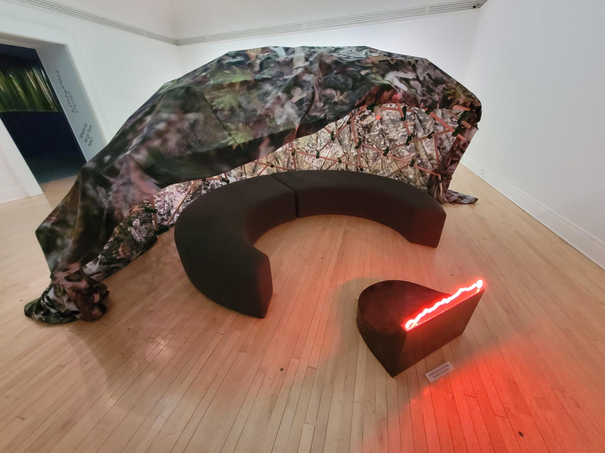
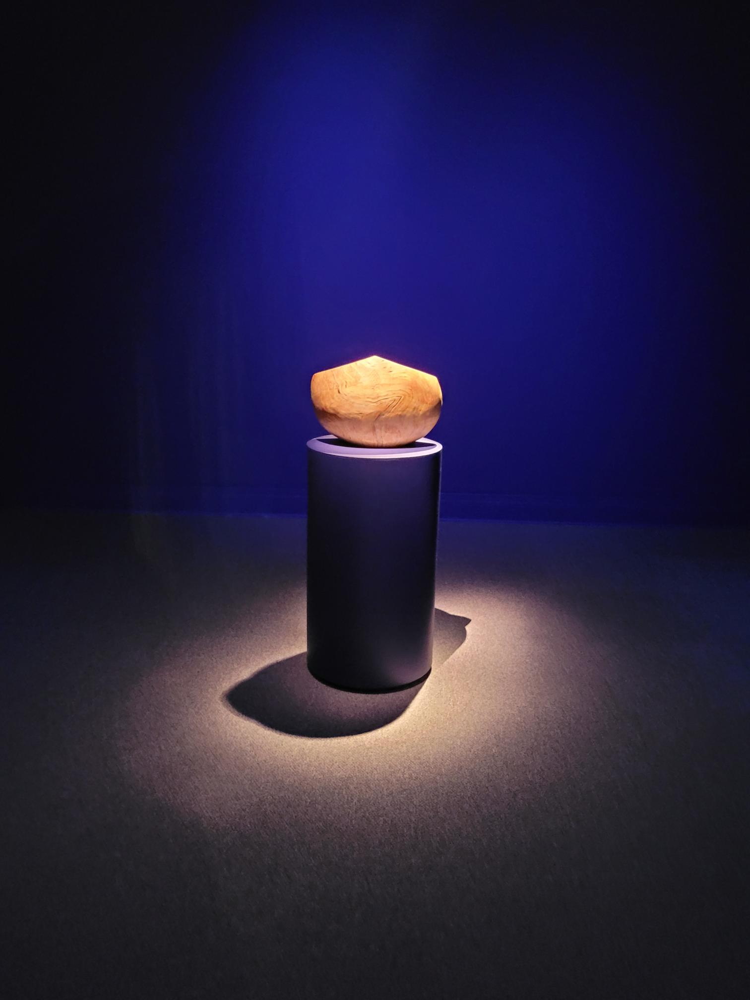
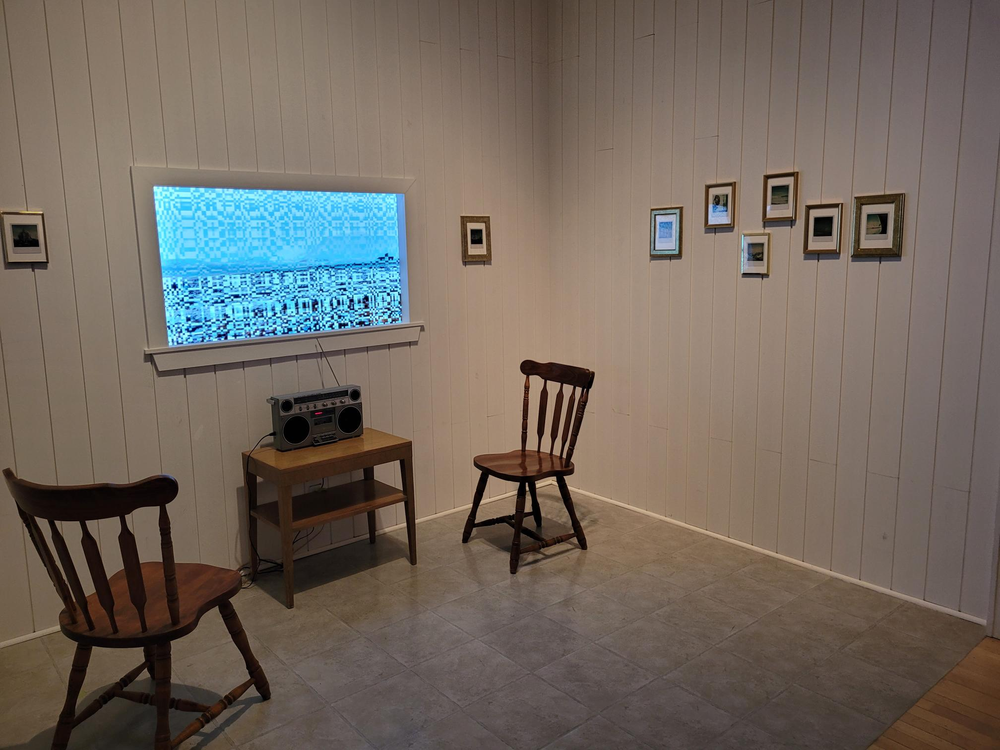
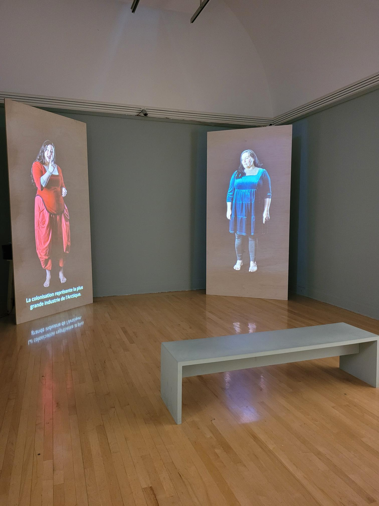
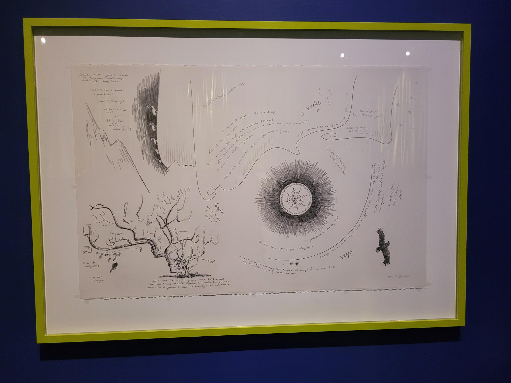
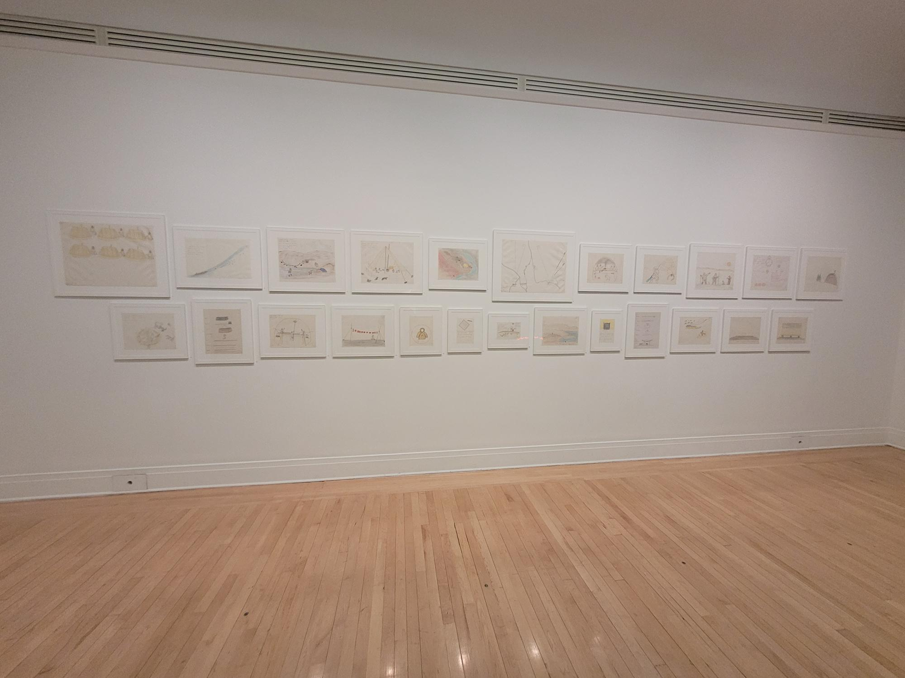

# Centre canadien d'architecture "vers chez soi"

##  présentation oeuvre

### Nom de l'exposition

- Vers chez soi

### Lieu de mise en exposition

- Centre canadien d'architecture

### Type d'exposition

- Temporaire et intérieur

### Date de visite

- 26 mars 

### Année de réalisation

- l'année de réalisation est 2022

### Description de l'oeuvre

- C'est un projet d’exposition et d’édition qui nous montre comment les peuples Inuits, les Sámis et d’autres communautés de l’Arctique créent des espaces d’autodétermination. L'exposition montre les conceptions et les constructions sur le territoire.

### Type d'installation

- L'installation est contemplative 

### Mise en espace

- Il y a plusieurs salles au deuxième étage avec des differents oeuvres qui sont présentées de manières différentes accompagnées des textes donnant des explications 

### Composantes et techniques

- Des fils pour les écrans
- Des fils pour la radio 
- Des haut parleurs

### Expérience vécue

- Mon expérience n'a pas été très bonne, car l'oeuvre n'avait aucune intéraction et rien était expliqué. Aussi les salles n'avaient pas un lien entre elle donc ça donnais beaucoup de confusion et je finissais par tourner en rond.

### Ce que j'ai aimé

- J'ai aimé le sujet de la présentation, car ça nous donne un certain point de vue des autochtones nordiques.

### Ce que j'ai moins apprécié

- J'ai pas aimé que l'oeuvre entière soit juste contemplative et qu'il n'a pas eu une seule vrai interaction

