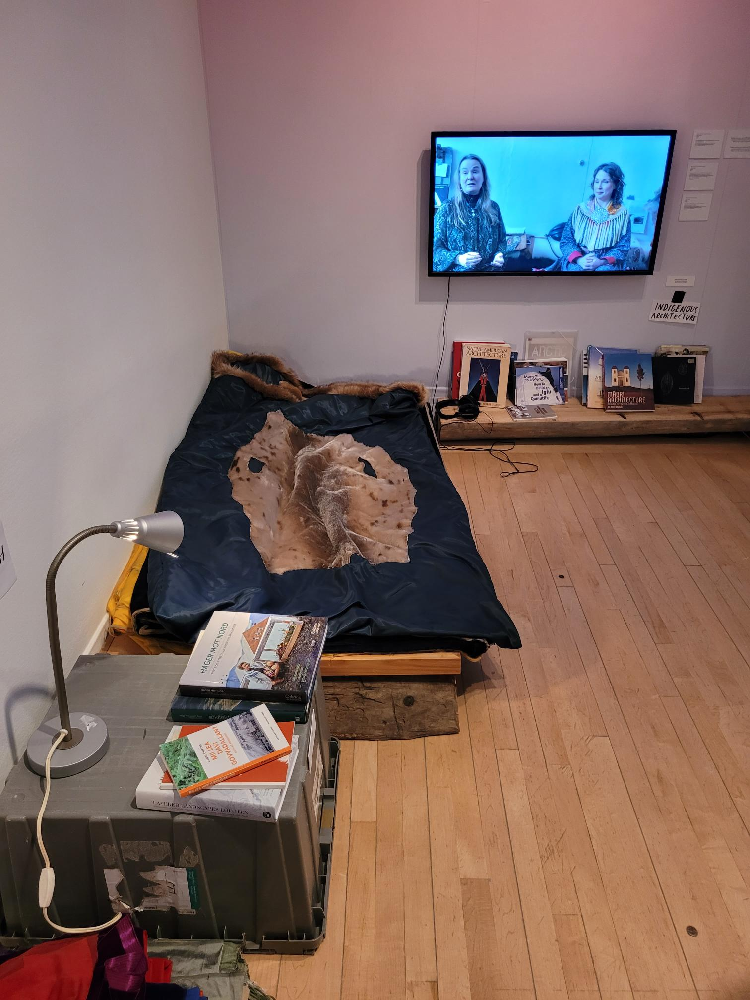

# Centre canadien d'architecture "vers chez soi"

##  présentation oeuvre

### Nom de l'exposition

- Vers chez soi

### Lieu de mise en exposition

- Centre canadien d'architecture

### Type d'exposition

- Temporaire et intérieur

### Date de visite

- 26 mars 

### Année de réalisation

- l'année de réalisation est 2022

### Description de l'oeuvre

- C'est un projet d’exposition et d’édition qui nous montre comment les peuples Inuits, les Sámis et d’autres communautés de l’Arctique créent des espaces d’autodétermination. L'exposition montre les conceptions et les constructions sur le territoire.

### Type d'installation

- L'installation est contemplative 

### Mise en espace

- Il y a plusieurs salles au deuxième étage avec des differents oeuvres qui sont présentées de manières différentes accompagnées des textes donnant des explications 

