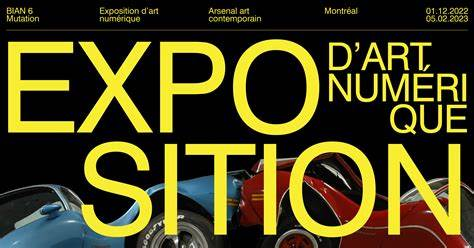

|:pencil2: À noter  | :camera: À photographier | 
| ---     | ---             | 
| Nom de l'exposition ou de l'événement||
| Lieu de mise en exposition    | | 
| Type d'exposition (temporaire, permanente, itinérante, intérieure, extérieure)    | Intérieur et temporaire | 
| Date de votre visite    | 2 février 2023           | 
| Titre de l'oeuvre  | performance robotique copacabana | 
| Nom de l'artiste    | Bill Vorn          | 
| Année de réalisation     | 2018         | 
| Description de l'oeuvre   | Cartel + diverses vues          | 
| Type d'installation (contemplative, immersive, interactive) | Vue *parlante*             | 
| Mise en espace   | Vue d'ensemble de la pièce + Faire un croquis de la mise en espace (plan ou élévation selon ce qui facilite la compréhension)        | 
| Composantes et techniques     | Chacune des parties composantes de l'oeuvre (ce que l'artiste a fait - pensez à ce qui doit voyager dans une caisse de transport si ceci est exposé outremer)| 
| Éléments nécessaires à la mise en exposition   | Chacun des éléments que le musée a mis en place pour que l'oeuvre soit exposée (bancs, cache-fil, crochets, sacs de sable, câbles, herses...)            | 
| Expérience vécue     | Posture du visiteur ou gestes de l'interacteur :movie_camera: possibilité d'intégrer de courts vidéos pour documenter les actions de l'oeuvre ou l'interactivité avec celle-ci        | 
| :heart: Ce qui vous a plu, vous a donné des idées (et pourquoi - justifications   | Éléments pertinents       | 
| :thinking: Aspect que vous ne souhaiteriez pas retenir pour vos propres créations ou que vous feriez autrement et justifications     | Éléments pertinents      | 

